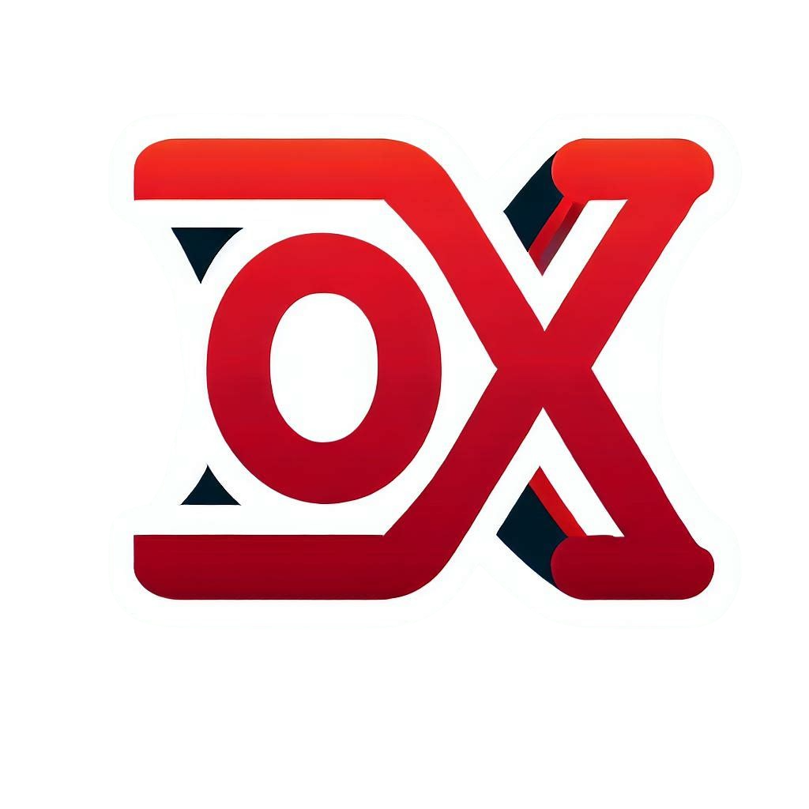

  <h1>
    OpenDX
     
    
  </h1>
  <i>The Open Source DirectX alternative for Linux.</i>
  
  **Compile:** `./build.sh && ./run.sh`
  
  

OpenDX is a fully-featured implementation of DirectX for the Linux operating system, without the need for compatibility layers or emulators. This allows Linux developers to build DirectX games and applications with improved performance.

  
  

## Improved Performance
We believe that Linux should have a native implementation of DirectX, which will provide improved performance and compatibility compared to compatibility layers such as Wine.
Although the project is still in development and we have a long way to go, we are committed to bringing you the best possible experience when playing DirectX games on Linux.

Here's a list of what OpenDX does better than Windows:
* dxdiag: Even on 11th gen Intel CPUs, dxdiag takes some time to open on Windows. On OpenDX, it opens instantly. Also, in the System tab, OpenDX shows the correct date and time, while Windows shows the date and time when dxdiag was opened (*lol*).

## [Join the OpenDX Community](https://github.com/EduApps-CDG/OpenDX/discussions)
If you are interested in contributing to OpenDX or just want to stay up-to-date on the project, please join the community and share your toughts.

## Give us a Star and Contribute
If you like OpenDX, please give us a star on GitHub. This will help us to attract more users and contributors.

Join us on our journey to bring DirectX to Linux!
